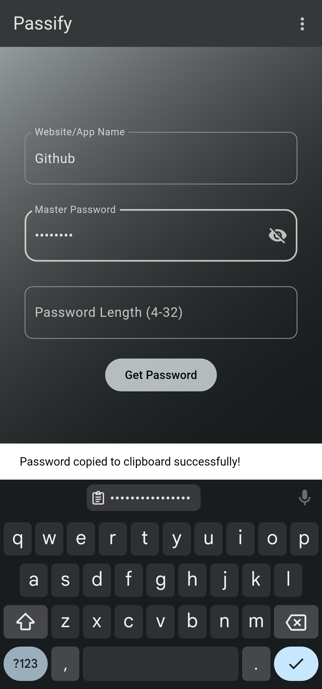
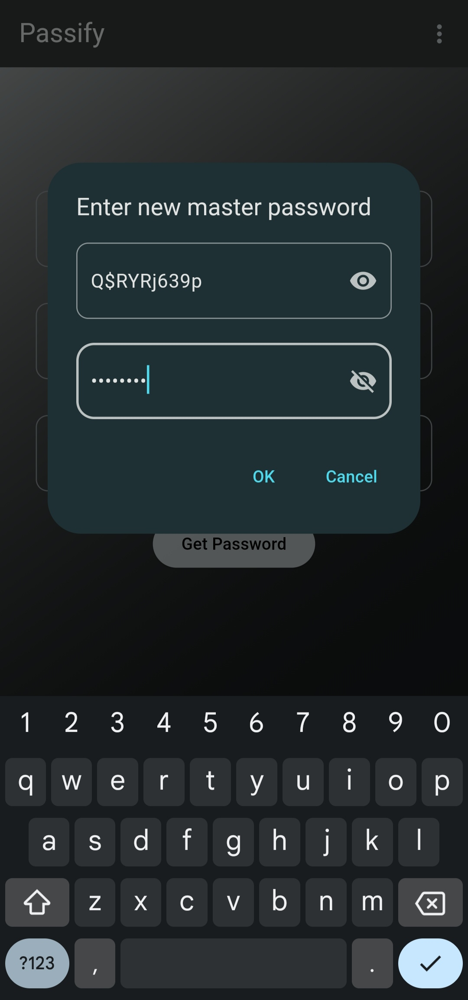

<a name="readme-top"></a>
<br />
<div align="center">
  <a href="https://mdanisulh.github.io/passify">
    
  </a>

<h1><a href="https://mdanisulh.github.io/passify"><strong>Passify</strong>
  </a></h1>
  <p align="center">
    A password generator and manager
    <br />
    <a href="https://github.com/mdanisulh/passify/issues">Report Bug</a>
    ·
    <a href="https://github.com/mdanisulh/passify/issues">Request Feature</a>
  </p>
</div>

Passify is a cross-platform password generator application developed using Flutter. It provides a secure and convenient way to generate and manage passwords on various devices.

If you are still reading this, then before you think of Passify as any other random password generator app, let me tell you that it is not. Passify generates all your passwords locally without sending any data to any server. It also does not store any of your passwords in any database but still you will be able to get your passwords from any device if you remember your master password. All your passwords are generated realtime through a one way hashing algorithm (Argon2id).

Passify takes a master password and a website name as input and generates a hash for that password. Now based on that hash a password is generated. As the generated hash is unique and one way the generated password is also unique for each website. So, now you don't have to remember all your passwords. You just have to remember your master password and Passify will generate the password for you.

## Screenshots
<p float="center" align="center">
  
   
</p>

## Features
- Generate passwords for any website.
- Generate passwords for custom length.
- Mobile, Desktop and Web support (Chrome Extension is also available).
- No internet connection required.
- Completely secure till you remember your master password and it is not compromised.
- No need to sync your passwords, you can use the same master password and app name used when creating the password and the same password will be generated again on any device.
- Argon2id is used for hashing which is the winner of the 2015 OWASP Password Hashing Competition.
- To prevent rainbow table attacks, a salt is added to the master password before computing and storing the hash.
- No data is stored apart from the Argon2id hash of the master password that is stored locally to make sure there is no error in your master password which could otherwise generate a totally different password.

## Things to keep in mind
- The master password should be strong and should not be compromised. Do not use any common words or phrases as your master password.
- The master password should be at least 8 characters long.
- The master password should not be the same as any of your other passwords.
- If the master password is compromised, all your passwords could be compromised.
- If any of the services you use suffers from a data breach or any of your password is compromised (not the master password), you can easily change your password for that service without affecting any other passwords by simply adding one more character in its name.
For example, if your password for Facebook is compromised, you can simply change the name of the service to Facebook1 and you will get a new password for Facebook. You can also change the name of the service to Facebook2 or Facebook3 and so on to get a new password for Facebook.
- If you forget your master password, you will not be able to recover it. You will have to reset it and all your passwords will be lost. So, make sure you remember your master password.
- If you forget the name of the service for which you generated the password, you will not be able to recover it. You will have to reset it. So, make sure you remember the name of the service for which you generated the password. If you use google as the name of service then entering gmail will never give you the same password.
- If you forget the length of the password you generated, you will not be able to recover it. You will have to reset it. So, make sure you remember the length of the password you generated, if you change it. By default it is 16 characters long.
- The website/ application name that you enter is case insensitive and also the leading and trailing whitespaces are trimmed. So, if you enter ```Facebook``` or ```facebook ``` or ```FACEBOOK```, you will get the same password for the same master password.

## Installation
> **Note:** There are no prebuilt executable files available for Windows, IOS and MacOS. To install Passify for any of these platforms you have to build it on your own.

### Website
You can access the web app [here](https://mdanisulh.github.io/passify).

### Chrome Extension
Passify is not available on the Chrome Web Store. To install it you have to download the zip file and load it as an unpacked extension. You can follow the steps below to do so.
1. Download and extract the zip file from [here](https://github.com/mdanisulh/passify/releases/download/v1.0.0/passify-chrome-extension.zip).
2. Open Google Chrome and go to `chrome://extensions/`.
3. Enable Developer Mode.
4. Click on `Load unpacked` and select the extracted folder.

The extension will be loaded and you will be able to see the Passify icon on the top right corner of your browser.

### Android
You can install **Passify** for android from [here](https://github.com/mdanisulh/passify/releases/tag/v1.0.0). There are 4 apks for android. If you are sure about the processor architecture your device uses you can download and install that respective apk. Otherwise you can download and install the [universal apk](https://github.com/mdanisulh/passify/releases/download/v1.0.0/android-app-universal.apk).
> **Note:** The universal apk takes up more space but is compatible with both 32 and 64 bit processor architecture.

### Linux
You can intall the tar file for Linux from [here](https://github.com/mdanisulh/passify/releases/download/v1.0.0/linux-x86_64.tar.gz). After extracting it you will be able to see some bash scripts and passify directory. You can start the app by executing the binary file in the passify directory.
To permanently install the app and display it on your Application Menu you can open a terminal and execute the following command
```
./install.sh
```
To uninstall the application you can open a terminal in the extracted directory and execute the following command
```
./uninstall.sh
```
